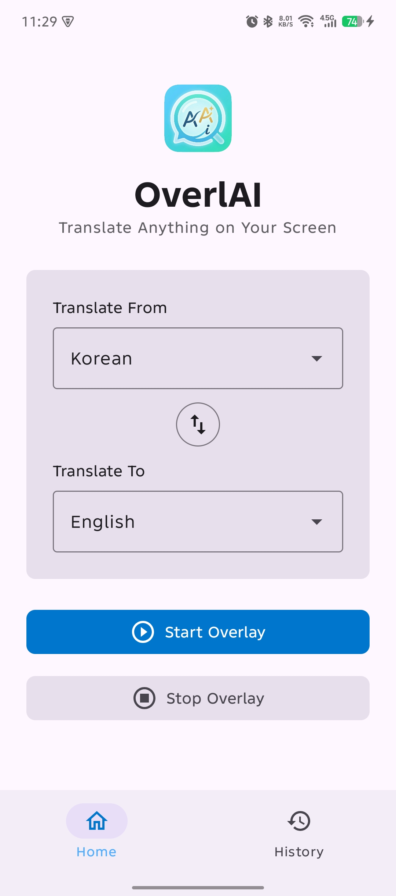
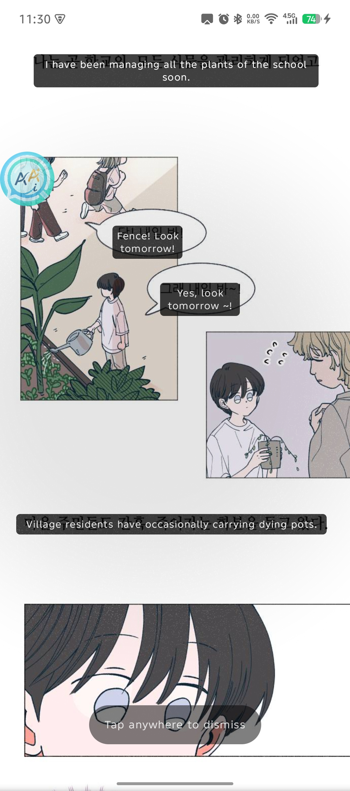
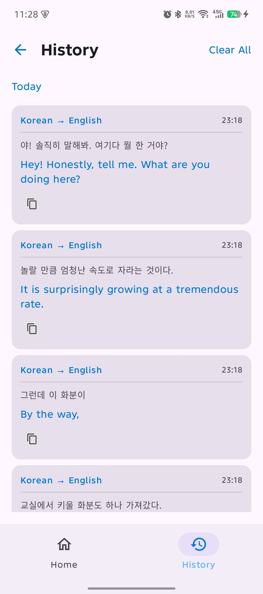
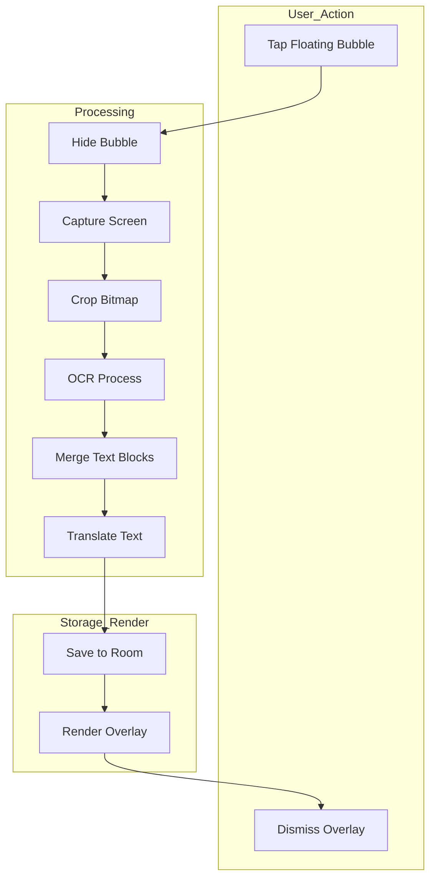
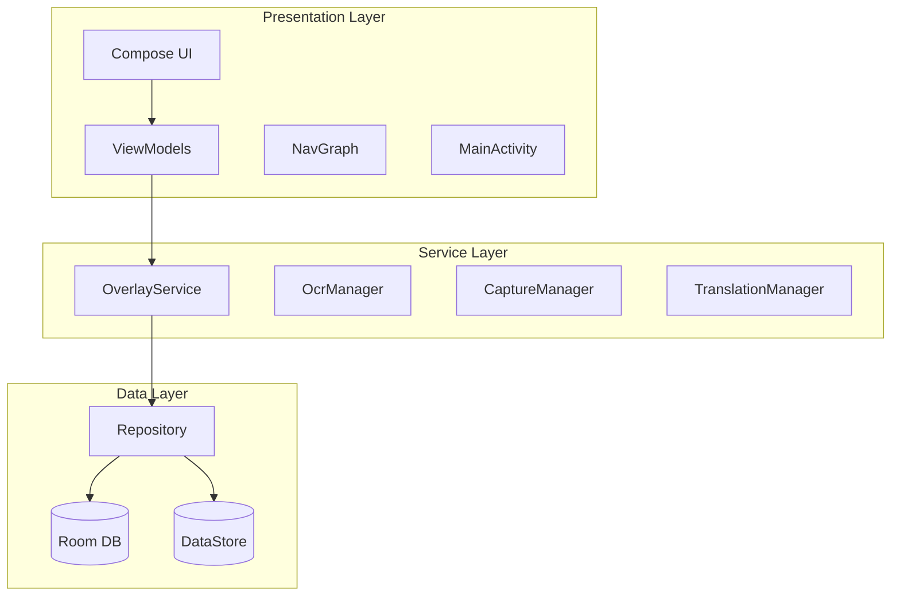

# OverlAI — AI Overlay Translator

> Translate Anything on Your Screen without switching apps.

OverlAI is an Android floating overlay app that captures on-screen text, performs OCR, and displays translated results directly over your screen in real-time. Built for manga, manhwa, and webtoon readers who want seamless translation without leaving their reading app.

---

## 🚀 Features

### Core (MVP)
- **Onboarding** : First-launch walkthrough explaining permissions and core concept
- **Floating Bubble** : Draggable overlay bubble with snap-to-edge behavior
- **Screen Capture** : One-tap screen capture via MediaProjection API
- **OCR Recognition** : On-device text recognition for Japanese, Korean, Chinese, and Latin scripts
- **AI Translation** : On-device translation powered by ML Kit (no internet required)
- **Translation Overlay** : Translated text rendered directly over original text with accurate positioning
- **Language Settings** : Configurable source and target language (ID/EN)
- **Translation History** : Paginated history with date grouping, swipe-to-delete, and undo

### Post-MVP (Planned)
- [ ] Overlay translation position adjustment
- [ ] Capture region selection
- [ ] Auto font scaling
- [ ] Auto language detection
- [ ] Custom glossary / translation override
- [ ] Theme & font customization
- [ ] Filter, search and bookmarks in translation history
- [ ] Model management

---
## 📱 Preview

### Demo

### Screenshots

|Home Screen|Translation Overlay|History Screen|
|:---------:|:-----------------:|:------------:|
|  |  |  |

---

## 🗺️ How It Works

---

## 🏗️ Architecture

OverlAI follows Clean Architecture principles without a domain layer, repositories are injected directly into ViewModels for simplicity.

The service layer isolates long-running overlay and capture operations from UI lifecycle to prevent Activity-related crashes.

---

## 🛠️ Tech Stack

- **Language** : Kotlin
- **UI** : Jetpack Compose + Material 3
- **Architecture** : MVVM + Clean Architecture (no domain layer)
- **DI** : Hilt
- **ML** : ML Kit Text Recognition + ML Kit Translate
- **Database** : Room + Paging 3
- **Preferences** : DataStore
- **Build** : AGP, Kotlin DSL

### Key Technical Decisions

|    Decision    | Choice                                 | Reason                                 |
|:--------------:|:---------------------------------------|:---------------------------------------|
|       UI       | Jetpack Compose + Material 3           | Modern declarative UI                  |                
|       DI       | Hilt                                   | Industry standard, compile-time safety |
|     Async      | Coroutines + Flow                      | Structured concurrency                 |
|      OCR       | ML Kit Text Recognition                | On-device, free, multi-script support  |
|  Translation   | ML Kit Translate                       | On-device, no API key needed           |
|       DB       | Room + Paging 3                        | Efficient paginated history            |
|     Prefs      | DataStore                              | Coroutine-friendly, type-safe          |

---
## 🧩 Technical Challenges

### Screenshot noise from system UI (status bar & floating bubble)
- **Problem**: Captured screenshots included system UI elements, introducing noise that degraded OCR accuracy.
- **Solution**: Temporarily hid the floating bubble before capture and cropped the status bar area from the bitmap prior to OCR processing.

### MediaProjection lifecycle limitations
- **Problem**: Android restricts MediaProjection to a single active VirtualDisplay, leading to potential conflicts and capture failures.
- **Solution**: Implemented strict lifecycle management and synchronization to ensure only one active capture session at a time.

### Vertical Japanese text reconstruction
- **Problem**: ML Kit returns fragmented OCR blocks, especially for vertical Japanese text, breaking reading order.
- **Solution**: Developed a custom proximity-based merging algorithm to reconstruct logical reading sequences (vertical & horizontal aware).

### Overlay touch interaction conflicts
- **Problem**: Overlay windows can block interaction with underlying apps if not configured properly.
- **Solution**: Dynamically adjusted window flags to toggle between touchable and non-touchable states based on interaction context.
---

## ⚠️ Known Limitations

- **OCR accuracy** : ML Kit accuracy is ~85-90% for clear Japanese text. Stylized manga fonts may reduce accuracy
- **Vertical text ordering** : Merged OCR blocks for vertical Japanese text may occasionally have incorrect reading order
- **Fullscreen apps** : Apps that hide the status bar may have slight vertical offset in overlay positioning
- **Dense text** : Not optimized for paragraph-heavy content, best suited for manga/manhwa speech bubbles
- **Translation quality** : ML Kit uses English as a pivot language (JP → EN → ID), which may reduce quality slightly vs. direct translation APIs
- **Single VirtualDisplay** : Android restricts MediaProjection to one active VirtualDisplay; app requires restart if projection is interrupted

---

Built with ❤️ as an Android portfolio project
